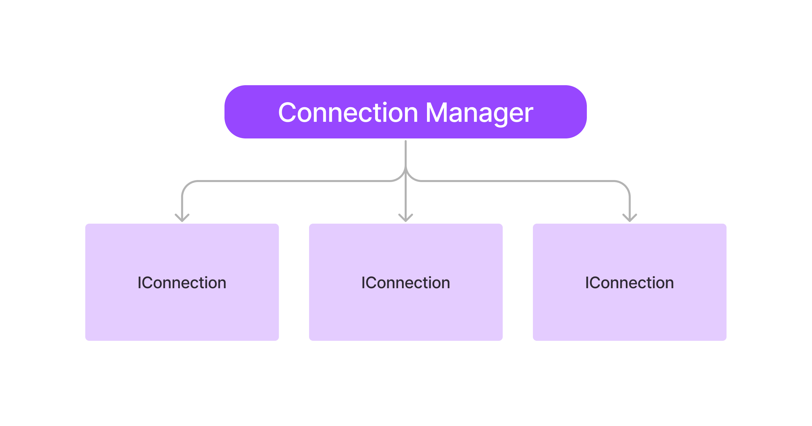

# ConnectionManager

Para melhor entendimento segue uma ilustração:

<figure><figcaption></figcaption></figure>

Como pode ver acima o Connection Manager é capaz de gerenciar diversas conexões e caso a conexão principal caia ele já aciona outra automáticamente o que é chamado de FailBack

### Construtor

**public ConnectionManager(String name)**

O campo nome é obrigatório porque caso o construir lide com múltiplos servidor a API será capaz de atender

OBS: É fortemente recomendável também ter um **nome único** para cada Connection Manager

<mark style="color:red;"><strong>Erros:</strong></mark>

* <mark style="color:red;">NullPointerException</mark> : Ocorre quando o nome é vazio ou nulo

### Métodos Da Classe

#### public void addConnection([IConnection](../../readme/classes/iconnection.md)\<?> connection)

Método responsável por registrar o conector do banco de dados a ser usado.

<mark style="color:red;"><strong>Erros</strong></mark>

* <mark style="color:red;">DuplicateConnectionNameException</mark> : Ocorre quando o nome da conexão já existe
* <mark style="color:red;">Exception</mark> : Ocorre quando qualquer erro que aconteça ao tentar ao registrar a conexão

#### public Connection getConnection()

Método responsável de abrir e obter a conexão

<mark style="color:red;"><strong>Erros</strong></mark>

* <mark style="color:red;">NullPointerException</mark> : Ocorre quando não há nenhuma conexão registrada
* <mark style="color:red;">ConnectionNotEstablishedException</mark> : Ocorre quando não foi possível estabilizar a conexão com o banco de dados por qualquer motivo que seja
* <mark style="color:red;">SQLException</mark>: Ocorre quando há alguma inconsistência no código SQL
* <mark style="color:red;">ClassNotFoundException</mark>: Ocorre quando a classe do driver do banco de dados não for encontrada

#### public [IConnection](../../readme/classes/iconnection.md)\<?> getConnectionByName(String name)

Retorna um conector de banco de dados conforme o nome da conexão

<mark style="color:red;"><strong>Erros</strong></mark>

* [<mark style="color:red;">NullPointerException</mark>](#user-content-fn-1)[^1] : Ocorre quando não há nenhuma conexão registrada ou quando o nome está vazio
* <mark style="color:red;">Exception</mark>: Ocorre quando é disparado algum erro na função que busca a conexão

#### public void closeConnection()

Realiza o fechamento da conexão que foi aberta para interagir com o banco de dados

<mark style="color:red;"><strong>Erros</strong></mark>

* <mark style="color:red;">SQLException</mark> : Ocorre quando  houver algum problema durante o fechamento da conexão com o banco de dados

#### public void removeConnection(String connectionName)

Remove um IConnection baseado no nome da conexão

<mark style="color:red;"><strong>Erros</strong></mark>

[<mark style="color:red;">NullPointerException</mark>](#user-content-fn-2)[^2] : Ocorre quando não for passado o nome da conexão

#### public [ConnectionType](../enums/connectiontype.md) getConnectionType()

Retorna o [ConnectionType](../enums/connectiontype.md) correspondente da conexão. Ou seja, retorna o tipo da conexão

#### public Connection getLogConnecton()

Retorna a conexão do banco de dados de log

<mark style="color:red;"><strong>Erros</strong></mark>

* <mark style="color:red;">ConnectionNotEstablishedException</mark>: Ocorre quando não foi possível fazer a conexão com o banco de dados de Logs
* <mark style="color:red;">SQLException</mark>: Ocorre quando há alguma inconsistência no código SQL
* <mark style="color:red;">ClassNotFoundException</mark>: Ocorre quando a classe do driver do banco de dados não for encontrada

#### public String getName()

Retorna o nome do ConnectionManager

[^1]: 

[^2]: 
